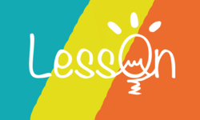

# Less0n

Less0n is the next generation of course and professor ratings system for Columbia community. It is now available at https://less0n.bmao.tech/ or https://less0n.herokuapp.com/.

This is a class project for COMS W4156 Advanced Software Engineering, Spring 2018 at Columbia University. We have just won the First Prize on the Demo Day at J.P. Morgan.

## Authors

- Yiming Guo ([@Nicole-gym](https://github.com/Nicole-gym))	yg2529@columbia.edu
- Yilan He ([@elenahoho](https://github.com/elenahoho))	yh2961@columbia.edu
- Zhijian Jiang ([@ZhijianJiang](https://github.com/ZhijianJiang))	zj2226@columbia.edu
- Bowen Mao ([@maobowen](https://github.com/maobowen))	bm2734@columbia.edu

For general inquires, please send us an email at less0n.cu@gmail.com.
